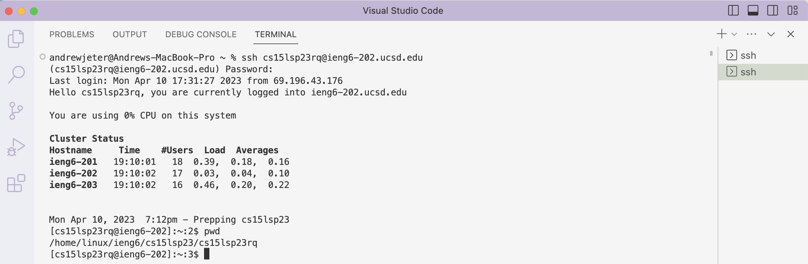

# Lab Report 1 | Remote Access and FileSystem

## Andrew Jeter | April 10, 2023 | CSE 15L Politz, J.

Welcome new CSE 15L students! Throughout this post, I will go through the steps to log into your course-specific account on `ieng6`!
While it might seem a little bit daunting at first, once you go through these steps I'm confident that you'll be able to understand the remote access login process and some basic FileSystem commands to be able to do it yourself with no problem! :)


*credit: [https://makeameme.org/meme/no-worries-youve](https://makeameme.org/meme/no-worries-youve)*

## Step 1: Installing Visual Studio Code
Before we begin, I'm going to address some terms below.

Q: What is Visual Studio Code (VSCode) and why do I need it?
> A: VSCode is an application that allows you to create programs using different programming languages, and for our purposes today, will allow you to login using `ssh`. To remotely access your acccount on `ieng6`, we will need to use `ssh` on VSCode using your account credentials.

Q: What is `ssh`?
> A: `ssh` stands for 'Secure Shell' which is a secure way to remotely access and/or operate a network system over an unsecure network. For our purposes today, we will be using your course-specific account information to log in remotely on `ieng6`!

Installing VSCode is pretty straightforward. 

1. You will need to go to the Visual Studio Code website [https://code.visualstudio.com](https://code.visualstudio.com) and follow the instructions specific to your operating system (macOS, Linux, or Windows).
2. After you've installed VSCode, open a new window that looks like this below. Mine is themed to look light lilac, but yours might have any other combination of colors, which might depend on your operating system. 

## Step 2: Remotely Connecting
Before we remotely connect to `ieng6`, you'll need to make sure you have your course-specific username and password to be able to use `ssh` to remotely connect to `ieng6`.

1. Make sure you visit this website [https://sdacs.ucsd.edu/~icc/index.php](https://sdacs.ucsd.edu/~icc/index.php) to view your username, and if needed, create a password on the same website.

Once you have your account credentials, using VScode, open a new terminal. On macOS, you can do this by going to `Terminal` and then clicking `New Terminal`.

When you have the terminal open, you will initiate the `ssh` connection by entering the following command into the terminal and filling in the `__` with the corresponding characters of your username:

*(The `$` symbol is to show that this is a command you will type in)*
````
$ ssh cs15lsp23__@ieng6.ucsd.edu
````
If this is the first time that you are connecting to this server, a message might pop up. Here is a screenshot of what it might look like: 
This is **expected**! Don't worry. What is happening here is that your computer client is trying to make sure that you're connecting to the right server. Enter `yes` in the terminal.

Next, you should be prompted to enter your password. When entering your password, your computer **will not** show the characters as you enter them, this is **expected**! Don't worry. Just enter your password, and then you should see an output like this from the `ieng6` server: 

Congratulations! You've successfully connected to an `ieng6` server in the CSE building, and you're now able to run commands from your computer remotely onto the server! I told you it would be straightforward and easy :)

## Step 3: Running Commands
Now that you have successfully connected to `ieng6`, it's time to try entering some commands! This will be fun :)

For starters, what is a command? A command is a line of code that is entered into the terminal that runs an operation. For example, if we want the server to list the current working directory, we can type `pwd` into the terminal, and the terminal should output: 
This command prints the current working directory, and in this case, the current working directory is `/home/linux/ieng6/cs15lsp23/cs15lsp23rq`.

Some other useful commands are `cd`, `ls`, `mkdir`, and `cp`.
- `cd` means change directory. You can use `cd` to change the current working directory by typing `$ cd _` where you replace _ with the path you'd like to change the current working directory to. Try typing in `cd ~`.
- `ls` means list files. If you type `ls` in as a command, it will list all the files in the current directory. However, other things happen if you add `-lat` or `-a` at the end. Try these out in your terminal and see what the outputs are!
- `mkdir` means make directory. This command allows you to create new directories, which might be useful when you want to add new files into a directory that isn't yet established. Try typing it in with a new directory to create!
- `cp` means copy (a file). You can use `cp` to copy a file into a directory. Try `cp /home/linux/ieng6/cs15lsp23/public/hello.txt ~/`
- `cat` means concatenate. You can use `cat` to combine and open files.

Here is what the output was for me when I tried a few of these commands!

With this brief outline of some useful commands, try exploring `ieng6` on your own by entering more commands yourself!
See! I knew you could do it! 
