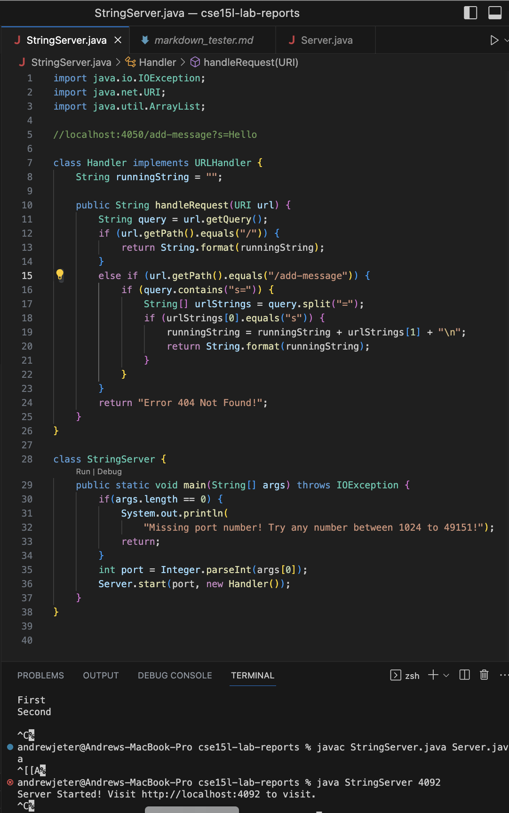
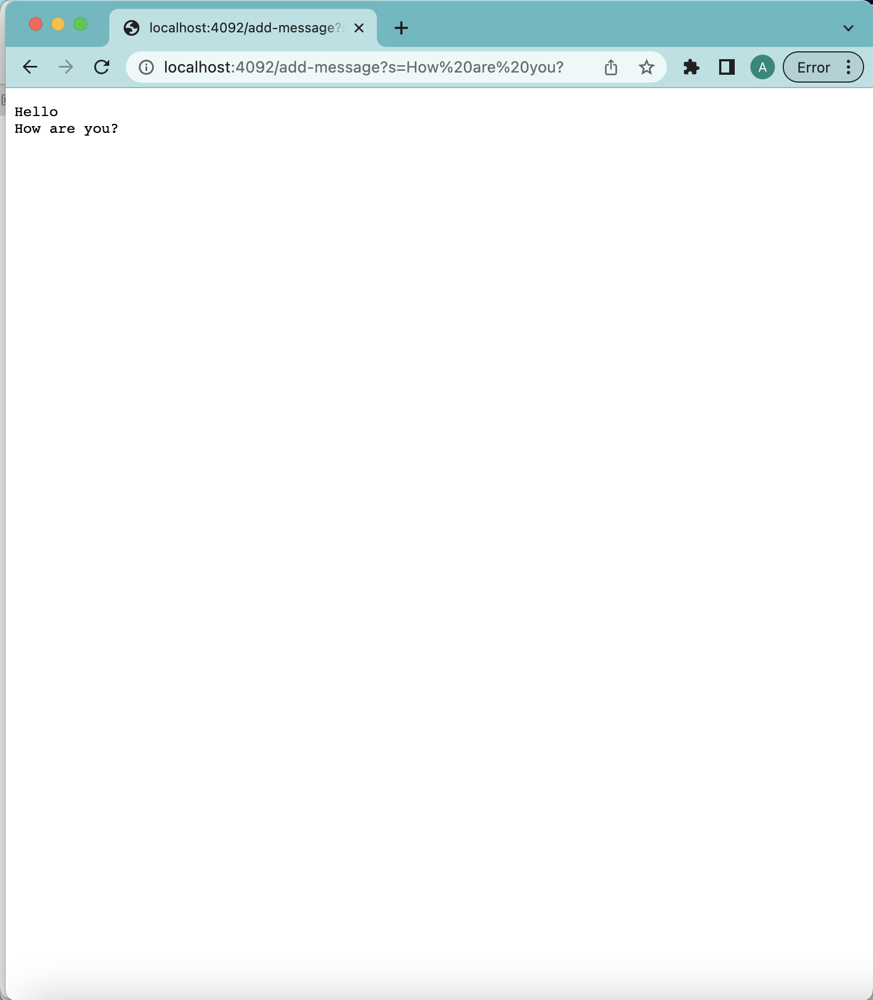

# Lab Report 2 | Servers and Bugs
## Andrew Jeter | April 22, 2023 | CSE 15L Politz, J.

Welcome back CSE15L students! I know what it has been only a few weeks since the last post, but I am excited for what we will be talking about today! I'm confident that if you did well during the first tutorial you'll do even better on this one! We will be writing a web server called `StringServer` that supports the specified path and behavior that I will describe below. The web server that we develop will be able to keep track of a string that gets added to by incoming url requests.

The specific request that the web server will handle is:

`/add-message?s=<string>`

This url request will concatenate a new line (`\n`) and the string given after the `=` in the query to the running string in the web server, and the server will then output the entire sting so far.

For example, after

`/add-message?=Hi!`

The page should display

> `Hi!`

and after

`/add-message?s=How are you doing today?`

the page should show

> `Hi!`
> 
> `How are you doing today?`

When writing this web server, it is important to note the criterion of the writeup. Here, you will need to create `runningString`, a passive variable of type `String` that will be added to. This is because the web server needs to be able to handle multiple requests, and they are to be concatenated together on new lines for each string given through a new request. The implemented code for `StringServer` will look like this.

***

When using the `/add-message?s=Hello` url request, here is what the web server should do:

In this screenshot, handleRequest is called to actually *do* something with the url inputted. This depends on the path inputted, and depending on this, the query inputted. For this screenshot, `Hello` is part of the query after the `?s=`. The relevent fields include `runningString`, `port`, `URI`, `urlStrings`, and `query. 

For this screenshot:

1. `int port = 4092`
2. `String URI = http://localhost:`
3. `String runningString = "Hello + \n"`
4. `String query = s=Hello`
5. `String[] urlStrings = {s=, Hello}`

Originally, the value of port is null, the value of runningString is an empty string, the value of query is an empty string, and the value of urlStrings is an empty string. The changes of the relevant fields of the class are made when you input the one string in the query of the `/add-message?s=<string>` request.

***

When using the `/add-message?s=How are you?` url request, here is what the web server should do:

In this screenshot, handleRequest is again to _handle_ the request. This url request 
