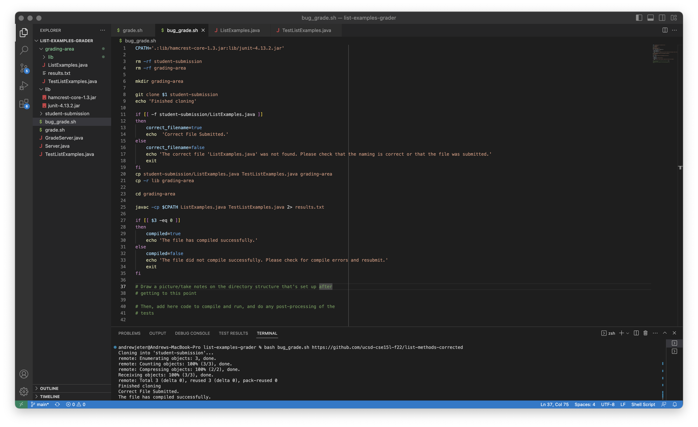

# Lab Report 5 | Debugging Scenario
## Andrew Jeter | June 5, 2023 | CSE 15L Politz, J.

For this Lab Report, I will be writing a hypothetical debugging post that would be made on the class EdStem, and walking through the steps to fix and address the question on my end, providing screenshots along the way. This bug will be within the list-examples-grader repository used during Lab 7, and a bug in `grade.sh` will be to blame for the fauly outcome only seen if looking closely. For the purposes of this lab report, `grade.sh` is the correct bash script, and `bug_grade.sh` is the buggy bash script. When calling `grade.sh`, I will call `bug_grade.sh`. Additionally, this debugging post will provide screenshots using `bug_grade.sh`. As always, we got this :) 

### EdStem Debugging Post Screening Questions:

**What environment are you using (computer, operating system, web browser, terminal/editor, and so on)?**

_MacOS, Safari, Visual Studio Code; Code Repository: [https://github.com/acjeter/list-examples-grader](https://github.com/acjeter/list-examples-grader)

**Detail the symptom you're seeing. Be specific; include both what you're seeing and what you expected to see instead. Screenshots are great, copy-pasted terminal output is also great. Avoid saying “it doesn't work”.**

When using this 'student code' implementation, it has no errors, so it is expected to pass the compile and file check, and it does, with no errors. Here is the screenshot of a proper execution of `bug_grade.sh` using this line: 

However, when using the lab files which are expected to cause a compile error, no such compile error is displayed by `bug_grade.sh` in the Terminal, and I'm not sure what's wrong with my code. Can you help me? Here is the buggy output: 

**Detail the failure-inducing input and context. That might mean any or all of the command you're running, a test case, command-line arguments, working directory, even the last few commands you ran. Do your best to provide as much context as you can.**

When using the code that is stated to provide a correct compile, pass the file check, and all the JUnit testers, the `bug_grade.sh` script returns with no errors. However, when using the code that is supposed to throw a compile error in `bug_grade.sh`, there is no such compile error.

***

### TA Response:

Hello! After a thorough review of your `bug_grade.sh` script, it looks like there might be an error on line 27, where the script checks for compile errors. The variable should be `$?`, not `$3`. The full line should be `if [[ $? -eq 0 ]]`. Try that and then reply with the output and if it works!

### Student Response:

Thank you so much! It seems that fix worked! Here is the output of `bug_grade.sh`. 

***

1. The repository with the buggy `grade.sh` file and the correct `grade.sh` file is [https://github.com/acjeter/list-examples-grader](https://github.com/acjeter/list-examples-grader). The files used are `bug_grade.sh` which contains the bug, and `grade.sh` which is the correct file with no bugs. Code is in the screenshots above.

2. `bash bug_grade.sh https://github.com/ucsd-cse15l-f22/list-methods-compile-error` is the symptom-inducing input
3. `bash bug_grade.sh https://github.com/ucsd-cse15l-f22/list-methods-corrected` has correct output

## Reflection
I loved my labs! They were absolutely the most fun part of school every week, and I had fun working with my classmates and the amazing tutor Crystal. I loved learning through experience, and my favorite lab was probably the one where we learned about `grep`. I thought it was super cool moving all that data around and putting it all into different files and manipulating the output as well! Overall I loved this class! :)

